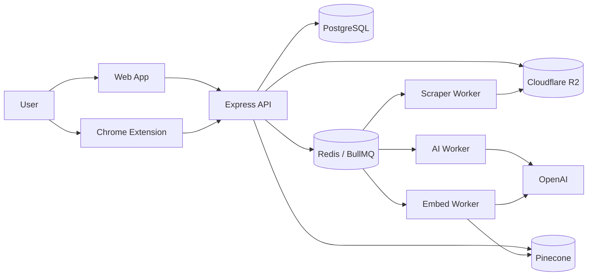
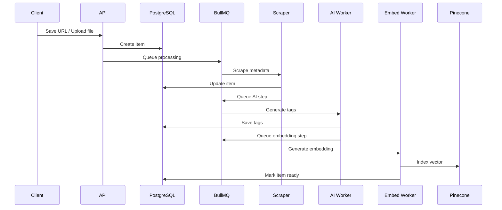

# Recall

<div align="center">


Personal knowledge infrastructure for saving content, enriching it with AI, and retrieving it through search, relationships, and graph exploration.

</div>

## Overview

Recall is a full-stack product for capturing web content from a dashboard or Chrome extension, processing it asynchronously, and turning it into a searchable personal knowledge base.

It is built to feel like a real production system, not a demo:
- multi-surface capture
- asynchronous worker pipeline
- semantic retrieval
- graph visualization
- production deployment split across Vercel and Render

## Snapshot

| Area | What it does |
|---|---|
| Capture | Save links, upload PDFs/images, one-click browser extension save |
| Enrichment | Scrape metadata with `metascraper`, generate AI tags with OpenAI |
| Retrieval | Semantic search, keyword fallback, related items |
| Organization | Tags, collections, archive states |
| Exploration | Knowledge graph view of connected saved content |
| Runtime | Web app, API, worker process, browser extension |

## Why It Stands Out

- End-to-end product thinking: capture, process, organize, retrieve
- Real backend workflow: queue-based workers instead of synchronous everything
- Production-minded architecture: Vercel frontend, Render API/worker, external managed services
- Strong technical breadth: frontend UX, APIs, auth, storage, jobs, vector search

## Core Features

- Save URL content
- Upload PDF and image content
- Metadata scraping using `metascraper`
- AI tag generation using OpenAI
- Semantic search
- Related items
- Tag management
- Collection management
- Knowledge graph view
- One-click extension save
- Authentication and user sync

## Architecture

### Style

This project is a **modular monolith with worker processes**.

- One core API codebase
- One primary relational schema
- Separate runtime roles for API and workers
- Shared infrastructure across ingestion, processing, and retrieval

### System Diagram



### Processing Flow



## Tech Stack

### Frontend

- `Next.js 16`
- `React 19`
- `TypeScript`
- `@clerk/nextjs`
- `@tanstack/react-query`
- `zustand`
- `Tailwind CSS`
- `react-force-graph-2d`

### Backend

- `Node.js`
- `Express`
- `TypeScript`
- `Prisma`
- `PostgreSQL`
- `BullMQ`
- `ioredis`
- `OpenAI`
- `Pinecone`
- `Cloudflare R2`
- `metascraper`

### Extension

- `Plasmo`
- `React 18`
- `Chrome MV3`

## Repository Structure

```text
.
├─ apps/
│  ├─ api/        # Express API, Prisma, workers
│  ├─ web/        # Next.js application
│  └─ extension/  # Browser extension
├─ docs/
│  └─ prd.md      # Product and rollout planning
└─ packages/
   └─ shared/     # Reserved shared package space
```

## Route Map

### Web

- `/`
- `/dashboard`
- `/dashboard/add`
- `/dashboard/items/[id]`
- `/dashboard/search`
- `/dashboard/graph`
- `/dashboard/tags`
- `/dashboard/collections`
- `/dashboard/archive`
- `/login/[[...rest]]`
- `/register/[[...rest]]`

### API

Base path: `/v1`

- `/auth/extension/login`
- `/auth/sync`
- `/auth/me`
- `/items`
- `/items/upload`
- `/items/:id`
- `/items/:id/related`
- `/items/:id/retry`
- `/tags`
- `/tags/:id`
- `/tags/attach/:itemId`
- `/collections`
- `/collections/:id`
- `/collections/:id/items`
- `/collections/:id/items/:itemId`
- `/search`
- `/graph`
- `/health`

## API Endpoints

### Auth

| Method | Endpoint | Purpose |
|---|---|---|
| `POST` | `/v1/auth/extension/login` | Sign in the browser extension and return an extension token |
| `POST` | `/v1/auth/sync` | Sync the authenticated Clerk user into the local database |
| `GET` | `/v1/auth/me` | Return the current authenticated user |

### Items

| Method | Endpoint | Purpose |
|---|---|---|
| `GET` | `/v1/items` | List user items with filters and pagination |
| `POST` | `/v1/items` | Save a new URL-based item |
| `POST` | `/v1/items/upload` | Upload a PDF or image item |
| `GET` | `/v1/items/:id` | Get one item with tags and highlights |
| `PATCH` | `/v1/items/:id` | Update title, description, archive state, favorite state, or note |
| `DELETE` | `/v1/items/:id` | Delete an item |
| `GET` | `/v1/items/:id/related` | Fetch related items using vectors with tag fallback |
| `POST` | `/v1/items/:id/retry` | Re-run processing for a failed or stale item |

### Tags

| Method | Endpoint | Purpose |
|---|---|---|
| `GET` | `/v1/tags` | List all tags for the current user |
| `POST` | `/v1/tags` | Create a tag |
| `PATCH` | `/v1/tags/:id` | Update a tag |
| `DELETE` | `/v1/tags/:id` | Delete a tag |
| `POST` | `/v1/tags/attach/:itemId` | Attach an existing or new tag to an item |

### Collections

| Method | Endpoint | Purpose |
|---|---|---|
| `GET` | `/v1/collections` | List collections |
| `POST` | `/v1/collections` | Create a collection |
| `GET` | `/v1/collections/:id` | Get one collection with its items |
| `PATCH` | `/v1/collections/:id` | Update collection details |
| `DELETE` | `/v1/collections/:id` | Delete a collection |
| `POST` | `/v1/collections/:id/items` | Add an item to a collection |
| `DELETE` | `/v1/collections/:id/items/:itemId` | Remove an item from a collection |

### Search and Graph

| Method | Endpoint | Purpose |
|---|---|---|
| `GET` | `/v1/search?q=&type=semantic|keyword` | Search items by meaning or keyword |
| `GET` | `/v1/graph` | Return graph nodes and edges for the current user |
| `GET` | `/health` | Health check endpoint |

## Quick Start

### Prerequisites

- `Node.js 20+`
- `npm 10+`
- PostgreSQL database
- Redis instance
- OpenAI API key
- Pinecone API key and index
- Clerk credentials
- Cloudflare R2 credentials

### Install

```bash
cd apps/api
npm install

cd ../web
npm install

cd ../extension
npm install
```

### Configure

- API env: `apps/api/.env`
- Web env: `apps/web/.env.local`
- Extension env: `PLASMO_PUBLIC_API_URL`

Templates already present:
- `apps/api/.env.example`
- `apps/web/.env.example`

### Run Locally

```bash
cd apps/api
npm run dev
```

```bash
cd apps/api
npm run worker
```

```bash
cd apps/web
npm run dev
```

Local endpoints:
- Web: `http://localhost:3000`
- API health: `http://localhost:4000/health`

## Environment Notes

- `NODE_ENV=development` uses `NEXT_PUBLIC_API_URL_DEV`
- `NODE_ENV=production` uses `NEXT_PUBLIC_RENDER_API_URL`
- Pinecone must use **1024 dimensions** because embeddings are generated with `text-embedding-3-small` at `1024`

## Available Scripts

### `apps/api`

- `npm run dev`
- `npm run worker`
- `npm run build`
- `npm run start`
- `npm run start:worker`
- `npm run prisma:generate`
- `npm run db:push`

### `apps/web`

- `npm run dev`
- `npm run build`
- `npm run start`
- `npm run lint`

### `apps/extension`

- `npm run dev`
- `npm run build`
- `npm run package`

## Deployment

| Surface | Platform | Start command |
|---|---|---|
| Frontend | Vercel | `next build` / `next start` |
| API | Render Web Service | `node dist/index.js` |
| Worker | Render Background Worker | `node dist/workers/index.js` |

Build command for API and worker:

```bash
npm install && npm run build
```

## Troubleshooting

### `Cannot find module '@/lib/...'`

- Deploy the latest API runtime alias changes
- Rebuild with cleared cache if Render is holding old artifacts
- Confirm the service starts from `dist/index.js`

### `Port scan timeout`

- API must be a Render **Web Service**
- Worker must be a Render **Background Worker**
- API must bind to `0.0.0.0:$PORT`

### Jobs not processing

- Check `REDIS_URL`
- Confirm the worker service is running
- Confirm API and worker share the same queue configuration

## Roadmap

- More ingestion sources
- Better graph relevance controls
- Public collections
- Improved observability

## Contributing

Recommended workflow:

1. Branch from `develop`
2. Make focused changes
3. Run build and lint locally
4. Open a PR into `develop`

## Security

If you find a security issue, avoid posting exploit details publicly. Share it privately with the maintainers.

## License

No license file is currently published in this repository.

## Support

- Product planning: `docs/prd.md`
- App-specific docs: `apps/web/README.md`
- Extension docs: `apps/extension/README.md`
